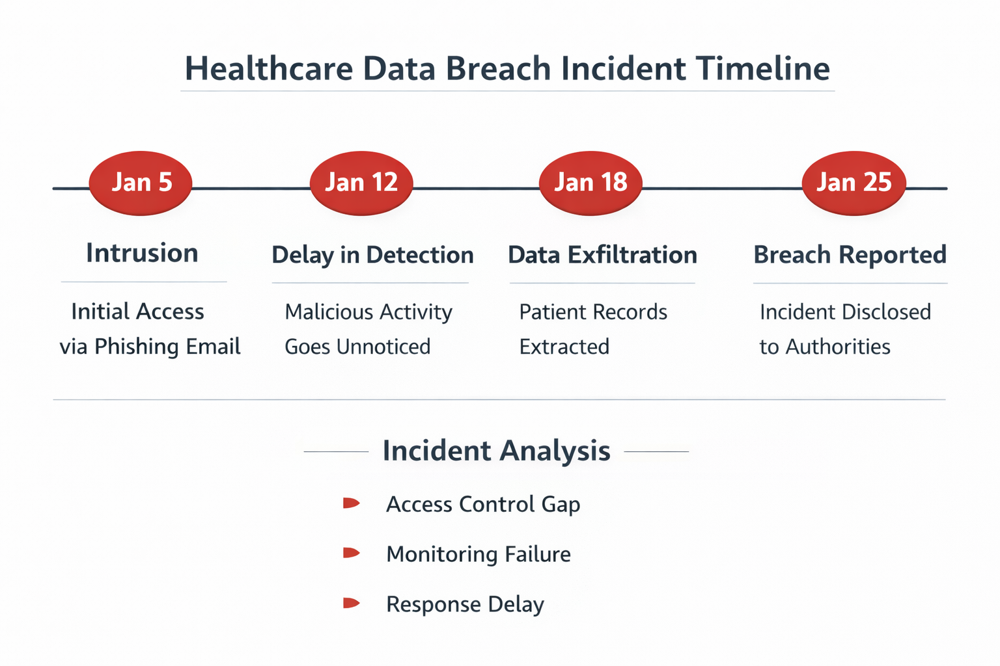

# Healthcare Data Breach Analysis

## Overview

This project analyzes a healthcare data breach through a security, operational, legal, and ethical lens. The focus is not only on what happened during the incident, but also on how monitoring gaps, access-control weaknesses, escalation delays, documentation quality, and communication decisions can increase risk in a regulated healthcare environment.

## Purpose

The purpose of this project is to show incident-analysis judgment. Healthcare organizations handle protected health information, so security failures can affect patient trust, regulatory exposure, legal risk, and daily operations. This analysis connects technical controls to real operational outcomes.

## Screenshot / Diagram

The timeline summarizes how delayed detection and response can increase breach impact. It also gives reviewers a quick way to understand the incident flow without reading the full paper first.

## Tools Used

- Incident timeline analysis
- Risk and impact analysis
- Confidentiality, integrity, and availability review
- HIPAA-focused security and privacy reasoning
- Multi-factor authentication and least-privilege control review
- Security monitoring and escalation analysis
- Technical writing and executive-style reporting
- PDF report documentation

## Project Snapshot

| Area | Summary |
|---|---|
| Incident focus | Healthcare data breach involving sensitive patient information |
| Primary concern | Unauthorized access, delayed detection, and exposure of protected information |
| Security themes | Monitoring, access control, MFA, least privilege, escalation, and breach communication |
| Business impact | Patient trust, legal exposure, regulatory pressure, and operational disruption |
| Deliverable type | Written security analysis with recommendations |

## What I Analyzed

- How unauthorized access remained active long enough to increase incident impact.
- Why sensitive patient information creates higher legal, ethical, and operational risk.
- How delayed detection affects containment, notification, and trust.
- Where routine IT support decisions can become security-critical escalation points.
- How stronger monitoring, MFA, least privilege, and documentation can reduce future risk.

## Core Findings

- Unauthorized access can become much more damaging when monitoring does not detect suspicious behavior quickly.
- Breaches in healthcare environments affect more than systems because patient trust and protected health information are involved.
- Incident response depends on clear escalation criteria so support teams know when an issue is no longer a normal ticket.
- Stronger authentication, least privilege, and role-based access reviews reduce the chance that one compromised account creates broad exposure.
- Communication quality matters because poor notification and documentation can increase reputational and regulatory damage.

## Recommendations

| Recommendation | Why It Matters |
|---|---|
| Improve continuous monitoring | Reduces dwell time and helps detect abnormal access sooner |
| Enforce MFA for privileged and remote access | Reduces credential-based compromise risk |
| Review least-privilege access | Limits unnecessary exposure of sensitive systems and data |
| Strengthen escalation criteria | Helps support teams identify security incidents faster |
| Improve breach communication | Supports patient trust, accountability, and regulatory expectations |

## What I Would Do in Week 1 on the Job

1. **Monitoring review:** Check alert sources, authentication logs, remote-access logs, and escalation paths to identify where suspicious activity could sit too long before action.
2. **Escalation criteria:** Clarify what turns a support issue into a security incident, including unusual access, privilege changes, repeated failed logins, or possible PHI exposure.
3. **MFA and least privilege:** Confirm privileged and remote-access accounts use MFA, then review role assignments so users only keep access required for their job duties.

## Key Learning

This project taught me how incident response, least privilege, MFA, monitoring, documentation, and escalation procedures work together to reduce organizational risk after a cybersecurity incident.

## Career Relevance

This project supports roles such as:

- Cybersecurity Analyst
- SOC Analyst
- IT Support Technician in regulated environments
- GRC Analyst
- Incident Response Support
- Risk Management or Compliance Support

## Evidence / Artifacts

Current artifact:

- PDF report: `../../assets/projects/Healthcare_Data_Breach_Analysis_Logan_Goodwin.pdf`
- Timeline image: `../../images/projects/healthcare-breach-timeline.png`
- Live portfolio project page: <https://loganggoodwin.github.io/projects/healthcare-breach-analysis/>

Recommended future artifacts:

- A one-page executive summary.
- A simple incident response workflow diagram.
- A table mapping recommendations to NIST Cybersecurity Framework functions.
- A short checklist for help desk escalation when PHI or suspicious account activity is involved.

## Portfolio Link

Live project page: <https://loganggoodwin.github.io/projects/healthcare-breach-analysis/>
