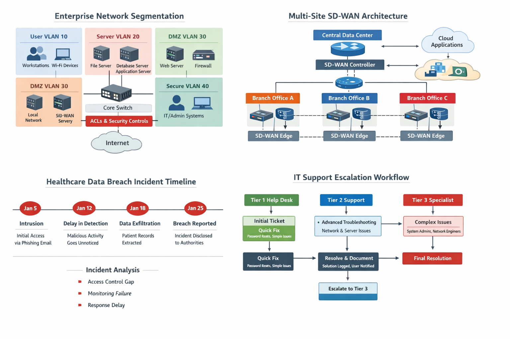

# Secure Enterprise Campus Infrastructure

## Overview

This project documents a secure small-enterprise campus network design built around segmentation, access control, and operational troubleshooting. I modeled the environment using VLANs, access-control logic, Layer 2 hardening, and a DMZ-style boundary so that user systems, guest access, printers, servers, management traffic, and public-facing services are separated instead of sitting on one flat network.

## Purpose

The purpose of this project is to show how network infrastructure design can reduce security risk and make support work easier. A segmented design helps limit lateral movement, improves incident containment, and gives IT staff clearer boundaries when they need to troubleshoot access, routing, firewall, or service-reachability problems.

## Screenshot / Diagram



**Recommended next screenshot to add:** a Cisco Packet Tracer topology screenshot showing the VLANs, Layer 3 device, ASA/firewall boundary, DMZ segment, and guest network path. This should be exported as an image and placed in an `evidence/` or `images/` folder.

## Tools Used

- Cisco Packet Tracer
- VLAN design and subnet planning
- Access Control Lists (ACLs)
- Cisco ASA / firewall policy concepts
- Layer 2 switch security concepts
- DHCP, DNS, and basic network services
- Network documentation and verification notes
- GitHub Pages / Markdown documentation

## Network Segmentation Plan

| VLAN | Name | Purpose | Default Gateway | Subnet |
|---:|---|---|---|---|
| 10 | USERS | Internal staff PCs | 10.10.10.1 | 10.10.10.0/24 |
| 20 | SERVERS | Critical infrastructure | 10.10.20.1 | 10.10.20.0/24 |
| 30 | PRINTERS | Network print services | 10.10.30.1 | 10.10.30.0/24 |
| 40 | GUEST_WIFI | Internet-only guest access | 10.10.40.1 | 10.10.40.0/24 |
| 50 | DMZ | Public web services | 10.10.50.1 | 10.10.50.0/24 |
| 99 | MGMT | Infrastructure administration | 10.10.99.1 | 10.10.99.0/24 |

## What I Built

- Created a segmented campus network layout for users, servers, printers, guest Wi-Fi, DMZ services, and management access.
- Designed guest isolation so guest traffic can use required services such as DNS and DHCP but cannot reach internal RFC1918 network resources.
- Documented Layer 2 hardening controls such as port security, DHCP snooping, PortFast, BPDU Guard, and trunk hardening.
- Placed public-facing services into a DMZ-style network zone instead of allowing direct access to internal server networks.
- Connected each technical control to an operational support purpose, such as easier troubleshooting, clearer escalation, and reduced blast radius.

## Example Configuration Logic

```text
ip access-list extended GUEST_ISO_ACL
 permit udp 10.10.40.0 0.0.0.255 any eq 53
 permit udp any any eq 67
 deny ip 10.10.40.0 0.0.0.255 10.10.0.0 0.0.255.255
 permit ip any any

interface vlan 40
 ip access-group GUEST_ISO_ACL in
```

This ACL example allows basic guest services while blocking guest access to internal enterprise address space.

## Verification / Testing Evidence

The project page currently documents the design logic and control objectives. The strongest next step is to attach direct verification artifacts.

Recommended evidence packet:

1. **Topology screenshot** showing VLANs, router/firewall placement, DMZ, and guest network.
2. **Successful internal test** showing authorized internal hosts reaching approved services.
3. **Guest isolation test** showing guest devices blocked from internal RFC1918 networks.
4. **DMZ policy test** showing public services reachable only through approved firewall rules.
5. **Sanitized configuration bundle** with switch, router, and firewall snippets cleaned of sensitive details.

Suggested verification commands/screenshots:

```text
ping 10.10.20.10        # Expected: allowed from authorized internal VLAN
ping 10.10.10.25        # Expected: blocked from guest VLAN
show vlan brief         # Expected: VLANs assigned correctly
show access-lists       # Expected: guest isolation ACL hit counts increase
show ip interface brief # Expected: SVI gateways up/up
```

## Security Controls Demonstrated

| Risk | Control | Why It Matters |
|---|---|---|
| Lateral movement | VLAN segmentation and ACLs | Limits how far a compromised device can move inside the network |
| Unauthorized devices | Port security | Helps control what connects to access ports |
| DHCP spoofing | DHCP snooping | Reduces rogue DHCP server risk |
| VLAN hopping | Trunk hardening and dedicated native VLAN | Reduces common switching misconfiguration risks |
| Public service exposure | DMZ isolation | Keeps public-facing services separated from trusted internal systems |

## Key Learning

This project taught me how VLAN segmentation, firewall rules, Layer 2 hardening, and verification testing work together to reduce risk and support enterprise network operations.

## Career Relevance

This project supports roles such as:

- Network Support Technician
- Help Desk / Desktop Support with networking responsibilities
- Junior Network Administrator
- Cybersecurity Analyst
- Infrastructure Support Specialist
- Security Operations or GRC support roles that require technical control understanding

## What I Would Improve Next

- Add the Packet Tracer `.pkt` file or a sanitized exported diagram.
- Add real test screenshots for blocked and allowed traffic paths.
- Add a sanitized configuration folder for router, switch, and firewall snippets.
- Add a short troubleshooting runbook for common issues such as VLAN misassignment, DNS failure, DHCP failure, and ACL blocking.
- Add a small change-management note explaining how new VLAN or firewall changes should be reviewed before implementation.

## Portfolio Link

Live project page: <https://loganggoodwin.github.io/projects/secure-enterprise-campus/>
